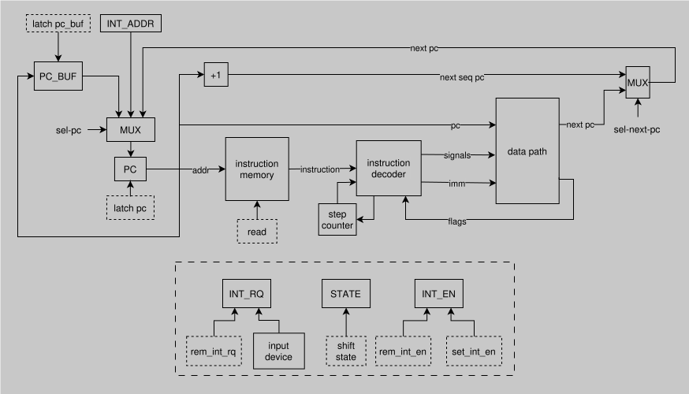

# Forth. Транслятор и модель

---

- Выполнил: Ступин Тимур Русланович, P3208
- `forth | risc | harv | hw | tick | binary | trap | mem | pstr | prob2 | superscalar`

## Язык программирования

### Синтаксис

Расширенная форма Бэкуса-Наура:

```ebnf
program ::= term EOF

term ::= word
       | statement
       | term term

word ::= symbol
       | number
       | extended-number
       | operation

statement ::= definition-statement
            | declaration-statement
            | interrupt-statement

symbol ::= defined-word
         | variable-name

number ::= [-2^31; 2^31-1]

extended-number ::= [-2^63; 2^63-1]'.'

operation ::= arithmetic-operation
            | extended-arithmetic-operation
            | binary-operation
            | logical-operation
            | stack-operation
            | extended-stack-operation
            | memory-operation
            | extended-memory-operation
            | io-operation
            | interrupt-operation

definition-statement ::= ':' defined-word statement-body ';'

declaration-statement ::= variable-declaration
                       |  extended-variable-declaration
                       |  string-literal-declaration
                       |  memory-block-declaration

interrupt-statement ::= 'begin_int' block 'end_int'

arithmetic-operation ::= '+' | '-' | '*' | '/'

extended-arithmetic-operation ::= '2+' | '2-' | '2*'

binary-operation ::= 'and' | 'or' | 'not' | 'xor'

logical-operation ::= '=' | '!=' | '>' | '>=' | '<' | '<='

stack-operation ::= 'dup' | 'drop' | 'swap' | 'over'

extended-stack-operation ::= '2dup' | '2drop' | '2swap' | '2over'

memory-operation ::= 'store' | 'load'

extended-memory-operation ::= '2store' | '2load'

io-operation ::= 'print' | 'read'

interrupt-operation ::= 'en_int' | 'di_int'

statement-body ::= block
                |  if-statement
                |  loop-statement
                |  statement-body

variable-declaration ::= 'var' variable-name

extended-variable-declaration ::= '2var' variable-name

string-literal-declaration ::= 'str' variable-name literal

memory-block-declaration ::= 'alloc' variable-name memory-block-size

block ::= word
        | block block

if-statement ::= 'if' statement-body ('then' | ('else' statement-body 'then'))

loop-statement ::= 'begin' statement-body 'until'

literal ::= '"' ascii-symbol'"'

memory-block-size ::= [1; 2^31 - 1]
```

### Семантика

- `<number>` -- положить значение `number` на вершину стека
- `<extended-number>.` -- положить значение двойной точности `extended-number` на стек (на вершине стека лежит старшая
  часть)
- `+` -- сложить два верхних элемента стека и положить результат на стек. Операнды убираются со стека
- `-` -- вычесть первое значение на стеке из второго и положить результат на стек. Операнды убираются со стека
- `*` -- перемножить два верхних элемента стека и результат положить на стек. Операнды убираются со стека
- `/` -- разделить нацело второй элемент стека на первый и положить результат на стек. Операнды убираются со стека
- `2+` -- сложить два числа двойной точности и положить результата на стек. Операнды убираются со стека
- `2-` -- вычесть верхнее число двойной точности, из числа ниже него и положить результата на стек. Операнды убираются
  со стека
- `2*` -- перемножить два верхних элемента стека и положить результат в виде числа двойной точности на стек. Операнды
  убираются со стека
- `and` -- выполнить операцию побитового `И` между двумя верхними элементами стека и результат положить на стек.
  Операнды убираются со стека
- `or` -- выполнить операцию побитового `ИЛИ` между двумя верхними элементами стека и результат положить на стек.
  Операнды убираются со стека
- `not` -- выполнить операцию побитового `НЕ` над верхним элементом стека
- `xor` -- выполнить операцию побитового `XOR` между двумя верхними элементами стека и результат положить на стек.
  Операнды убираются со стека
- `=` -- сравнить на равенство первый и второй элементы стека и положить результат на стек. Операнды убираются со стека
- `!=` -- сравнить на неравенство первый и второй элементы стека и положить результат на стек. Операнды убираются со
  стека
- `>` -- проверить что второй элемент стека строго больше первого и положить результат на стек. Операнды убираются со
  стека
- `<` -- проверить что второй элемент стека строго меньше первого и положить результат на стек. Операнды убираются со
  стека
- `>=` -- проверить что второй элемент стека больше либо равен первого и положить результат на стек. Операнды убираются
  со стека
- `<=` -- проверить что второй элемент стека меньше либо равен первого и положить результат на стек. Операнды убираются
  со стека
- `dup` -- продублировать верхний элемент стека
- `drop` -- удалить верхний элемент стека
- `swap` -- поменять местами верхний элемент стека и элемент после него
- `over` -- положить на вершину стека элемент через один от текущей вершины стека
- `2dup` -- аналогично `dup`, но для числа двойной точности
- `2drop` -- аналогично `drop`, но для числа двойной точности
- `2swap` -- аналогично `swap`, но для числа двойной точности
- `2over` -- аналогично `over`, но для числа двойной точности
- `store` -- взять верхний элемент стека и сохранить его по адресу хранящемуся во втором элементе стека. И значение и
  адрес убираются со стека
- `load` -- взять адрес из первого элемента стека и положить значение, хранящееся по этому адрес на стек. Адрес
  убирается со стека
- `2store` -- аналогично `store`, но для числа двойной точности. В начале в память записывается старшая часть, затем
  младшая
- `2load` -- аналогично `load`, но для числа двойной точности. На вершине стека будет лежать старшая часть
- `print` -- взять верхний элемент со стека и вывести его в стандартный поток вывода
- `read` -- прочитать значение из стандартного потока ввода и положить его на стек
- `begin_int <block> end_int` -- определить обработчик прерывания
- `if <block> then` -- если значение верхнего элемента стека истинно, выполнить набор инструкций из `block`. При
  проверке элемент убирается со стека
- `if <block1> else <block2> then` -- если значение верхнего элемента стека истинно, выполнить набор инструкций из
  `block1`, иначе выполнить набор инструкций из `block2`. При проверке элемент убирается со стека
- `begin <block> until` -- если после того как выполнены инструкции из `block` значение верхнего элемента стека истинно,
  то блок выполняется ещё раз. При проверке элемент убирается со стека
- `var <name>` -- объявить переменную с именем `name`. При этом переменная привязывается к конкретной ячейке памяти
- `2var <name>` -- объявить переменную двойной точности с именем `name`. При этом выделяется 2 ячейки памяти, а
  переменная привязывается к адресу первой. Само число хранится в виде старшей и младшей части. Старшая часть
  размещается в памяти раньше младшей
- `str <name> " <literal>"` -- объявление строкового литерала с именем `name`. Литерал сохранятся в памяти в виде
  паскаль-строки. Переменная привязана к адресу начала строки (фактически ячейке в которой хранится длинна строки)
- `alloc <name> <size>` -- выделение блока памяти размера `size` с именем `name`. Размер указывается в ячейках памяти.
  Переменная привязывается к адресу начала блока
- `: <name> <body> ;` -- создать объявление с именем `name` и содержимым `body`
- `<definition-name>` -- на этапе компиляции данное значение заменяется блоком, соответствующим указанному объявлению
- `<variable-name>` -- положить на вершину стека адрес переменной с именем `variable-name`
- `en_int` -- разрешение прерываний
- `di_int` -- запрет прерываний

### Комментарии

Начинаются со знака `\` и идут до конца строки.

### Включение кода из других файлов

- Реализовано при помощи конструкции `#include "path_to_file"`
- Выполняет текстовую подстановку всего содержимого указанного файла вместо строки с `#inlude`
- Реализована базовая поддержка повторных включений, через сохранение путей к уже подключённым файлам в `set`

### Особенности реализации

- Циклы и условия могут быть только внутри определений (`definition`)
- Поддерживается произвольный уровень вложенности циклов и условий
- В ситуациях когда происходят проверки на истинность за `false` принимается нулевое значение, а любое другое значение
  считается равным `true`
- Все определения (`definition`) заменяются на своё содержимое на этапе трансляции
- Все блоки обработки прерываний объединяются в один
- При сохранении строковых литералов они размещаются по одному символу в ячейку памяти, без плотной упаковки

### Порядок выполнения

Программа выполняется последовательно, одна инструкция за другой.

### Память

- Распределяется статически на этапе трансляции
- Является общей для всей программы
- Строковые литералы и блоки данных хранятся в памяти в формате Pascal-string
- Память для переменных и блоков данных выделяется статически и заполняется нулевыми значениями
- Стек является частью памяти и растёт вниз от больших адресов к меньшим

### Области видимости

Все данные расположены в одной глобальной области видимости.

### Типизация, виды литералов

В языке определены четыре вида литералов:

- Строковые
- Целочисленные
- Целочисленные, двойной точности
- Блоки данных

Типизация отсутствует, так как переменные вводимые пользователем являются указателями на ячейку памяти и не привязаны к
типу.

## Организация памяти

- Гарвардская архитектура
- Размер машинного слова:

    - Память команд: 32 бита
    - Память данных: 32 бита

- Имеет линейное адресное пространство
- В памяти данных хранятся строковые литералы, переменные и блоки данных
- В памяти команд хранятся инструкции для выполнения
- Взаимодействие с памятью данных происходит через конструкции `load` и `store`
- Виды адресации:

    - Прямая абсолютная
    - Относительная

- Минимальная единица данных -- машинное слово (4 байта), соответственно адресация выполняется по машинным словам

> Решение об адресации по машинным словам было мотивировано следующими особенностями данной модели:
>
> - Строки в памяти хранятся не плотно
> - Минимальная единица данных с которой позволяет работать язык forth это машинное слово
> - Внешние устройства выдают одно машинное слово за раз

- Данные в памяти хранятся в формате Big-endian
- Строковые литералы размещаются в памяти в формате Pascal-string, по одному символу в ячейку памяти (без плотной
  упаковки)
- Целочисленные литералы загружаются прямой загрузкой в случае если их значение помещается в 21 бит аргумента
  непосредственной загрузки. Иначе загрузка происходит в 2 этапа, с использованием операции `lui`
- Целочисленные литералы двойной точности хранятся в двух ячейках и загружаются как два целочисленных литерала. При
  размещении в стеке и памяти старшее слово размещается раньше младшего
- Блоки данных хранятся в памяти в виде непрерывной последовательности ячеек в pascal-представлении, соответственно
  сначала идёт длинна блока, а затем сами данные
- Все переменные отображаются в память на этапе трансляции
- В начале памяти данных зарезервировано место для ячеек ввода-вывода

```plaintext
          Data memory
+------------------------------+
| 00  : input cell             |
| 01  : output cell            |
| 02  : str literals           |
| 03  : str literals           |
|    ...                       |
| k+0 : variable 1             |
| k+1 : variable 2             |
|    ...                       |
| n-2 : stack                  |
| n-1 : stack                  |
+------------------------------+
```

### Регистры

В модели присутствуют следующие регистры общего назначения:

- `SP` -- указатель стека
- `T0` -- вспомогательный регистр
- `T1` -- вспомогательный регистр
- `T2` -- вспомогательный регистр
- `T3` -- вспомогательный регистр
- `ZERO` -- машинный 0

Для адресации по памяти инструкций используется регистр `PC`.

Для работы с прерываниями в модели также присутствуют следующие регистры:

- `PC_BUF` -- регистр для сохранения `PC` при переходе к подпрограмме обработки прерываний
- `INT_RQ` -- регистр хранящий флаг запроса прерывания. Устанавливается устройством ввода. Может быть сброшен
  специальным сигналом
- `INT_ADDR` -- регистр хранящий адрес подпрограммы обработки прерываний (задаётся перед запуском модели)
- `INT_EN` -- регистр хранящие флаг, который определяет разрешены ли прерывания (по умолчанию сброшен). Может быть
  установлен или сброшен специальными сигналами
- `STATE` -- регистр хранящий состояние процессора. Меняет значения циклически по специальному сигналу

> Решение использовать один регистр для хранения адреса подпрограммы обработки прерываний вместо векторов
> прерываний было обусловлено тем, что задание не предполагает наличие более одного внешнего устройства.

Для сохранения состояния регистров общего назначения при появлении прерывания в модели используется
`shadow register file`, который содержит все регистры общего назначения кроме `ZERO`

> Решение использовать `shadow register file` вместо стандартного для risc сохранения регистров в стек было принято
> из-за того, что язык forth полностью строится на стеке, а значит заполнять его какими-либо данными помимо тех что
> предполагаются программой не рационально.
>
> Альтернатива в виде введения двух стеков не была реализована ввиду излишнего усложнения организации работы с памятью.

## Система команд

### Особенности процессора

- Доступ к памяти осуществляется при помощи инструкций `load` и `store`
- Устройство ввода-вывода: `memory-mapped`, ввод и вывод привязаны к $0$-му и $1$-му адресу в памяти данных
  соответственно
- Ввод осуществляется по прерыванию
- Адрес подпрограммы обработки прерываний задаётся в регистре `INT_ADDR` перед запуском модели
- Разрешение или запрет прерываний можно задать установкой флага в регистре `INT_EN`
- По умолчанию прерывания запрещены
- Перед переходом к подпрограмме обработки прерываний регистры общего назначения сохраняются в `shadow register file`
- Так как язык `forth` построен на использовании стека, подпрограммы обработки прерываний не должны изменять состояние
  стека. В случае если это произойдёт, поведение не определено, так как указатель стека будет возвращён в состояние до
  начала обработки прерывания

### Набор инструкций

| Название | Синтаксис               | Число тактов | Мнемоника                                                                                  | Описание                                                                                                    |
|:---------|-------------------------|:-------------|:-------------------------------------------------------------------------------------------|:------------------------------------------------------------------------------------------------------------|
| `lui`    | `lui <rd> <k>`          | 1            | `rd <- k << 8`                                                                             | Выполняет прямую загрузку значения `k`, сдвинутого влево на 8 бит в регистр `rd`                            |
| `j`      | `j <k>`                 | 1            | `pc <- pc + k`                                                                             | Выполняет переход через смещение на `k` относительно `PC`                                                   |
| `sw`     | `sw <rs1> <rs2> <k>`    | 2            | `M[rs1 + k] <- rs2`                                                                        | Выполняет сохранение значения из регистра `rs2` по адресу записанному в регистр `rs1`                       |
| `lw`     | `lw <rs1> <rd> <k>`     | 2            | `rd <- M[rs1 + k]`                                                                         | Выполняет сохранение значения из памяти по адресу записанному в регистр `rs1` в регистр `rd`                |
| `addi`   | `addi <rs1> <rd> <k>`   | 1            | `rd <- rs1 + k`                                                                            | Выполняет сохранение увеличенное на `k` значения регистра `rs1` в регистр `rd`                              |
| `jr`     | `jr <rs1> <k>`          | 1            | `rd <- pc + 1; pc <- rs1 + k`                                                              | Выполняет переход через смещение на `k` относительно `rs1` с сохранением адреса следующей инструкции в `rd` |
| `beq`    | `beq <rs1> <rs2> <k>`   | 2            | `zero <- rs1 - rs2; IF zero_flag THEN pc <- pc + k`                                        | Выполняет переход через смещение на `k` относительно `PC` в случае равенства `rs1` и `rs2`                  |
| `bne`    | `bne <rs1> <rs2> <k>`   | 2            | `zero <- rs1 - rs2; IF NOT zero_flag THEN pc <- pc + k`                                    | Выполняет переход через смещение на `k` относительно `PC` в случае НЕ равенства `rs1` и `rs2`               |
| `bgt`    | `bgt <rs1> <rs2> <k>`   | 2            | `zero <- rs1 - rs2; IF NOT zero_flag AND negative_flag == overflow_flag THEN pc <- pc + k` | Выполняет переход через смещение на `k` относительно `PC` в случае если `rs1` строго больше `rs2`           |
| `blt`    | `blt <rs1> <rs2> <k>`   | 2            | `zero <- rs1 - rs2; IF NOT zero_flag AND negative_flag != overflow_flag THEN pc <- pc + k` | Выполняет переход через смещение на `k` относительно `PC` в случае если `rs1` строго меньше `rs2`           |
| `add`    | `add <rs1> <rs2> <rd>`  | 1            | `rd <- rs1 + rs2`                                                                          | Выполняет суммирование `rs1` и `rs2` сохраняя результат в `rd`                                              |
| `addс`   | `addс <rs1> <rs2> <rd>` | 1            | `rd <- ((rs1 + rs2) >> WORD_SIZE) & 1`                                                     | Выполняет суммирование `rs1` и `rs2` сохраняя флаг переноса в `rd`                                          |
| `sub`    | `sub <rs1> <rs2> <rd>`  | 1            | `rd <- rs1 - rs2`                                                                          | Выполняет вычитание `rs2` из `rs1` сохраняя результат в `rd`                                                |
| `mul`    | `mul <rs1> <rs2> <rd>`  | 1            | `rd <- rs1 * rs2`                                                                          | Выполняет умножение `rs1` на `rs2` сохраняя результат в `rd`                                                |
| `mulh`   | `mulh <rs1> <rs2> <rd>` | 1            | `rd <- (rs1 * rs2) >> WORD_SIZE`                                                           | Выполняет умножение `rs1` на `rs2` сохраняя старшую часть результат в `rd`                                  |
| `div`    | `div <rs1> <rs2> <rd>`  | 1            | `rd <- rs1 // rs2`                                                                         | Выполняет целочисленное деление `rs1` на `rs2` сохраняя результат в `rd`                                    |
| `rem`    | `rem <rs1> <rs2> <rd>`  | 1            | `rd <- rs1 % rs2`                                                                          | Выполняет взятие остатка от деление `rs1` на `rs2` сохраняя результат в `rd`                                |
| `sll`    | `sll <rs1> <rs2> <rd>`  | 1            | `rd <- rs1 << rs2`                                                                         | Выполняет логический сдвиг `rs1` влево на `rs2` бит сохраняя результат в `rd`                               |
| `srl`    | `srl <rs1> <rs2> <rd>`  | 1            | `rd <- rs1 >> rs2`                                                                         | Выполняет логический сдвиг `rs1` вправо на `rs2` бит сохраняя результат в `rd`                              |
| `and`    | `and <rs1> <rs2> <rd>`  | 1            | `rd <- rs1 & rs2`                                                                          | Выполняет побитовое И между `rs1` и `rs2` сохраняя результат в `rd`                                         |
| `or`     | `or <rs1> <rs2> <rd>`   | 1            | `rd <- rs1 \| rs2`                                                                         | Выполняет побитовое ИЛИ между `rs1` и `rs2` сохраняя результат в `rd`                                       |
| `xor`    | `xor <rs1> <rs2> <rd>`  | 1            | `rd <- rs1 ^ rs2`                                                                          | Выполняет побитовый XOR между `rs1` и `rs2` сохраняя результат в `rd`                                       |
| `halt`   | `halt`                  | 1            | `stop`                                                                                     | Выполняет остановку моделирования                                                                           |
| `eint`   | `eint`                  | 1            | `set_int_en`                                                                               | Разрешает прерывания                                                                                        |
| `dint`   | `dint`                  | 1            | `rem_int_en`                                                                               | Запрещает прерывания                                                                                        |
| `rint`   | `rint`                  | 1            | `register_file <- shadow_register_file; pc <- pc_buf; state <- NORMAL`                     | Выполняет выход из подпрограммы обработки прерывания                                                        |

### Способ кодирования инструкций

Все инструкции имеют фиксированный размер: $32$ бита.

В младших $5$ битах всегда хранится opcode.

Дальнейшее содержимое бинарного представления инструкции зависит от её типа.

В данной модели процессора выделяется шесть видов инструкций:

1. `R` -- инструкции для выполнения арифметических и логических операций над данными в регистрах. Например `add`, `sub`
2. `I` -- инструкции, использующие непосредственные (константные) значения. Например `addi`, `lw`
3. `B` -- инструкции для условных переходов и чтения из памяти. Например `beq`, `bgt`, `sw`
4. `U` -- инструкции для загрузки больших непосредственных значений в регистры. Например `lui`
5. `J` -- инструкции для выполнения безусловных переходов со смещением относительно счётчика команд. Например `j`
6. `JR` -- инструкции для выполнения безусловных переходов со смещением относительно регистра. Например `jr`

#### Бинарное представление

Кодирование этих инструкций происходит следующим образом:

```plaintext
┌─────┬───────────────────────────────┬─────────┬─────────┬────────┬────────┐
│ тип │           31...14             │ 13...11 │  10...8 │  7...5 │  4..0  │
├─────┼───────────────────────────────┼─────────┼─────────┼────────┼────────┤
│  R  │                               │   rs2   │   rs1   │   rd   │ opcode │
├─────┼───────────────────────────────┴─────────┼─────────┼────────┼────────┤
│  I  │                   imm                   │   rs1   │   rd   │ opcode │
├─────┼─────────────────────────────────────────┴─────────┼────────┼────────┤
│  U  │                         imm                       │   rd   │ opcode │
├─────┼───────────────────────────────┬─────────┬─────────┼────────┼────────┤
│  B  │              imm              │   rs2   │   rs1   │   imm  │ opcode │
├─────┼───────────────────────────────┴─────────┴─────────┴────────┼────────┤
│  J  │                             imm                            │ opcode │
├─────┼─────────────────────────────────────────┬─────────┬────────┼────────┤
│ JR  │                   imm                   │   rs1   │   imm  │ opcode │
└─────┴─────────────────────────────────────────┴─────────┴────────┴────────┘
```

Также есть инструкции которые не имеют типа, так как влияют исключительно на состояние процессора. Это инструкции `halt`
`rint`, `eint`, `dint`.

Их бинарное представление имеет следующий вид:

```plaintext
┌──────────────────────────────────────────────────────────────────┬────────┐
│                             31...5                               │  4..0  │
├──────────────────────────────────────────────────────────────────┼────────┤
│                                                                  │ opcode │
└──────────────────────────────────────────────────────────────────┴────────┘
```

Коды операций:

- `00000` (`0x00`) -- `lui` -- загрузить верхнюю часть непосредственного значения в регистр
- `00001` (`0x01`) -- `lw` -- загрузить слово из памяти в регистр
- `00010` (`0x02`) -- `addi` -- прибавить непосредственное значение к регистру
- `00011` (`0x03`) -- `add` -- сложить значения двух регистров
- `00100` (`0x04`) -- `adc` -- сложить и положить перенос в регистр
- `00101` (`0x05`) -- `sub` -- вычесть значение одного регистра из другого
- `00110` (`0x06`) -- `mul` -- умножить значения двух регистров
- `00111` (`0x07`) -- `mulh` -- умножить и взять старшую часть результата
- `01000` (`0x08`) -- `div` -- разделить значения двух регистров
- `01001` (`0x09`) -- `rem` -- получить остаток от деления двух регистров
- `01010` (`0x0A`) -- `sll` -- сдвинуть значение регистра влево
- `01011` (`0x0B`) -- `srl` -- сдвинуть значение регистра вправо
- `01100` (`0x0C`) -- `and` -- выполнить побитовое И над двумя регистрами
- `01101` (`0x0D`) -- `or` -- выполнить побитовое ИЛИ над двумя регистрами
- `01110` (`0x0E`) -- `xor` -- выполнить побитовое ИСКЛЮЧАЮЩЕЕ ИЛИ над двумя регистрами
- `01111` (`0x0F`) -- `sw` -- сохранить слово из регистра в память
- `10000` (`0x10`) -- `beq` -- перейти, если значения двух регистров равны
- `10001` (`0x11`) -- `bne` -- перейти, если значения двух регистров не равны
- `10010` (`0x12`) -- `bgt` -- перейти, если значение одного регистра больше другого
- `10011` (`0x13`) -- `blt` -- перейти, если значение одного регистра меньше другого
- `10100` (`0x14`) -- `j` -- перейти со смещением относительно счётчика команд
- `10101` (`0x15`) -- `jr` -- перейти со смещением относительно регистра
- `10110` (`0x16`) -- `halt` -- остановить выполнение программы
- `10111` (`0x17`) -- `rint` -- возврат из прерывания
- `11000` (`0x18`) -- `eint` -- разрешить прерывания
- `11001` (`0x19`) -- `dint` -- запретить прерывания

#### JSON представление

- Машинный код сериализуется в JSON список
- Один элемент списка -- одна инструкция

Пример:

```json
[
  {
    "address": 0,
    "opcode": "addi",
    "rd": "t0",
    "rs1": "zero",
    "imm": -10
  },
  {
    "address": 1,
    "opcode": "addi",
    "rd": "sp",
    "rs1": "sp",
    "imm": -1
  }
]
```

Где:

- `address` -- адрес инструкции
- `opcode` -- код операции
- `rd`, `rs1`, `rs2`, `imm` -- различные аргументы инструкций

## Транслятор

Интерфейс командной строки: `translator.py <input_file> <target_instructions_file> <target_data_file>`

Реализовано в модуле: [translator](./src/translator)

Трансляции разделена на несколько этапов:

### Прерпроцессинг

- На данном этапе происходит раскрытие макросов, в данном случае только конструкции `#include`
- Реализовано в модуле [preprocessor](src/translator/preprocessor)
- В результате получаем текст программы без макросов. В данном случае с раскрытыми конструкциями `#include`

### Лексер

- На данном этапе происходит преобразование текста программы в последовательность токенов
- Реализовано в модуле [lexer](src/translator/lexer)
- Сами токены описаны в модуле [token](src/translator/token)

### Парсер

- На данном этапе набор токенов обрабатывается в соответствии с грамматикой и преобразуется в AST-дерево
- Реализовано в модуле [parser](src/translator/parser)
- Для ускорения процесса трансляции, парсер и лексер работают параллельно, соответственно парсер последовательно
  обрабатывает новые токены, поступающие от лексера
- Для более удобного задания правил обработки токенов, в
  файле [grammar_start_tokens](src/translator/token/grammar_start_tokens.py) определены ожидаемые стартовые токены для
  основных элементов грамматики
- Аст дерево и вспомогательные функции для него реализованы в модуле [ast_](src/translator/ast_)
- Также на этом этапе происходит:
    - раскрытие пользовательских определений
    - выделение строковых литералов
    - создание таблицы символов
- Помимо проверки синтаксической корректности кода, данный модуль выполняет проверку семантической корректности, а
  именно:
    - Переменные и определения объявлены до того как использованы
    - Нет дублирующихся имён переменных и определений
- Также производится проверка на соответствие числовых литералов заданным диапазонам допустимых значений

### Генератор кода

- На данном этапе по полученному AST-дереву, таблице символов и списку строковых литералов происходит формирование
  машинного кода
- Реализовано в модуле [code_generator](./src/translator/code_generator)
- Также на этом этапе происходит:
    - Формирования блока данных (сохранение строковых литералов, выделение памяти для переменных и блоков данных)
    - Формирование блока обработки прерываний и его добавление к основной программе

#### Правила генерации машинного кода

- В ходе генерации заполняются списки данных, инструкций основной программы и инструкций прерываний
- Ast дерево обходится рекурсивно, при помощи шаблона visitor, который реализован в
  классе [ast_node_visitor](src/translator/ast_/ast_node_visitor.py)
- Все правила генерации, которые предполагаю явное создание инструкций вынесены в
  файл [instruction_producers](src/translator/code_generator/instruction_producers.py) для большего удобства
- Данные и инструкции сохраняются в виде специальных объектов каждый из которых помимо основной информации хранит также
  адрес
- Переменные, строковые литералы и блоки данных размещаются в памяти последовательно. При этом по
  мере размещения в таблице символов уточняется адрес соответствующей конструкции, который затем используется при обращениях к памяти
- Численные литералы в начале преобразуется в бинарное представление, после чего загружаются:
    - прямой загрузкой (`addi`) если значения входит в диапазон $[-2^{20}, 2^{20}-1]$
    - загрузкой при помощи `lui` и `addi` иначе
- Значения двойной точности в начале разбиваются на два машинных слова, после чего выполняется загрузка каждого из них
  аналогично описанной выше
- Обработка циклов и условий выполняется при помощи операций условных и безусловных переходов
- Для корректной обработки условных и безусловны переходов на начальном этапе генерации машинного кода в массив
  инструкций вводятся заглушки в виде меток и заглушек для переходов. Они заменяются на реальные инструкции после
  определения адресов
- Когда списки данных и инструкций сформированы, в конец основной программы добавляется инструкция остановки `halt`,
  после чего происходит линковка:
    - Адреса инструкций расставляются последовательно, при этом основной блок инструкций начинается с нуля, а адрес
      обработчика прерываний можно задать в файле констант [constants](src/constants.py)
    - Также проверяется, что все инструкции помещаются в памяти инструкций (размер которой также задаются в файле
      констант) и что основной блок инструкций не перекрывает блок обработки прерываний
    - Адреса данных проставляются по порядку, при этом адрес начала задаётся в файле констант (так как начальные адреса
      зарезервированы для операций ввода-вывода)
- После линовки проиходит разрешение переходов, которое приводит к замене заглушек на реальные инструкции переходов

> Так было сделано потому, что до этапа линковки невозможно понять насколько далеко необходимо выполнить переход, а эта
> информация напрямую влияет на количество инструкций которые будут использованы для выполнения перехода.
>
> Это связано с особенностями кодирования инструкций в riscv, а именно тем что в одну инструкцию невозможно разместить
> полный 32-х разрядный адрес. Соответственно в случае если нет возможности выполнить переход за одну инструкцию через
> смещение может быть использован переход относительно регистра при помощи `JR`, но тогда переход будет занимать больше
> одной инструкции так как необходимо будет выполнить загрузку адреса через `lui` и `addi` после чего выполнить сам
> переход.

## Модель процессора

Интерфейс командной строки: `machine.py <instructions_bin_file> <data_bin_file> <input_file>`.

Реализовано в модуле: [machine](./src/machine).

### DataPath

Реализован в классе [DataPath](./src/machine/data_path.py).


Сигналы реализованы в виде методов класса, при этом так как в зависимости от конфигурации мультиплексоров сигналы могу
иметь разный эффект то возможно несколько реализаций одного и того же сигнала.

#### Сигналы Data Path

- `latch_data_address` -- защёлкнуть значение в адрес памяти данных
- `store_registers` -- защёлкнуть резервный блок регистров
- `restore_registers` -- защёлкнуть основной блок регистров
- `data_memory_store` -- записать значение в память
    - В случае если выбран адрес устройства вывода, значение добавляется в буфер вывода
    - В случае если выбран адрес устройства ввода, вызывается исключение
- `data_memory_load` -- прочитать значение из памяти
    - В случае если выбран адрес устройства ввода, значение берётся из в буфера ввода
    - В случае если выбран адрес устройства вывода, вызывается исключение
- `perform_alu_operation` -- выполнения операции АЛУ и установка флагов. В зависимости от сигналов мультиплексоров
  возможны следующие варианты:
    - `reg` `reg` -- оба операнда - регистры
    - `reg` `imm` -- первый операнд - регистр, второй операнд - непосредственное значение, после расширения знака
    - `reg` `uimm` -- первый операнд - регистр, второй операнд - непосредственное значения, сдвинутое влево на 8 бит
    - `pc` `imm` -- первый операнд - значения счётчика команд, полученное из Control Unit, а второй - непосредственное
      значение, после расширения знака

#### Флаги

Устанавливаются по результату каждой из операций АЛУ.

- `zero` -- в результате выполнения операции получен ноль
- `negative` -- результат отрицательный
- `overflow` -- в результате выполнения операции возникло переполнение

### ControlUnit

Реализован в классе [ControlUnit](./src/machine/control_unit.py).

.

- Hardwired (реализовано полностью на Python)
- Метод `process_next_tick` моделирует выполнение полного цикла инструкции (1-2 такта процессора)
- `step_counter` необходим для много-тактовых инструкций

#### Прерывания

Для обработки прерываний введены состояния процессора:

- `NORMAL` -- обычный режим работы, происходит последовательное извлечение инструкций из памяти команд и их
  выполнение
- `INT_ENTER` -- в этом режиме происходит сохранение регистров общего назначения в `shadow register file`, и переход
  к подпрограмме обработки прерывания
- `INT_BODY` -- этот режим полностью повторяет режим `NORMAL`, за исключением запрета прерываний в нём

Прерываний разрешены только в состоянии `NORMAL`.

Состояние процессора хранится в регистре `STATE` и по сигналу может меняться на следующее. Соответственно получается
следующий цикл смены состояний:

```plaintext
NORMAL  -->   INT_ENTER  -->  INT_BODY  --> NORMAL  -->   ...
```

##### Цикл обработки прерываний

В начале каждого такта происходит поиск номера такта в расписании прерываний. В случае если найдено совпадение,
прерывания разрешены и процессор находится в состоянии не запрещающем прерывания, происходит
установка флага запроса прерывания, а в `input_buffer` в `data-path` записывается пришедший
символ.

> Механика установки флага вместо мгновенной смены состояния была введена для решения двух проблем:
>
>1. Предотвращение перехода к циклу прерывания во время исполнения много-тактовой инструкции (например работы с памятью)
>2. Обеспечение возможности запомнить факт запроса прерывания, даже если нет возможности обработать его прямо сейчас

В случае если флаг запроса прерываний установлен, состояние процессора сейчас `NORMAL` и шаг (`step`) равен нулю (то
есть мы не внутри много-тактовой инструкции) происходит смена состояния на `INT_ENTER` и переход на следующий такт.

Когда процессор находится в состоянии `INT_ENTER` выполняется сохранение всех регистров общего
назначения в `shadow register file`. В одном такте с этой операцией происходит сохранение значения регистра `PC` в
регистр `PC_BUF`. В следующем такте происходит запись значения из регистра `INT_ADDR` в регистр `PC`, а состояние
процессора меняется на `INT_BODY`.

В состоянии `INT_BODY` процессор так же как и в состоянии `NORMAL` последовательно выполняет инструкции. Разница только
в том, что прерывания в нём запрещены.

Для выхода из подпрограммы обработки прерывания определена специальная инструкция `rint`, при вызове которой происходит
восстановление значений регистров общего назначения из `shadow register file`, и в одном такте с этим в регистр `PC`
записывается значение из регистра `PC_BUF` а состояние процессора меняется на `NORMAL`.

---

Сигналы реализованы в виде методов класса, при этом так как в зависимости от конфигурации мультиплексоров сигналы могу
иметь разный эффект то возможно несколько реализаций одного и того же сигнала.

#### Сигналы Control Unit

- `latch_pc` -- защёлкнуть значение счётчика команд. В зависимости от конфигурации мультиплексоров
  возможны следующие варианты:
    - `latch_pc_seq` -- защёлкнуть значение счётчика команд, увеличенное на единицу
    - `latch_pc_imm` -- защёлкнуть значение счётчика команд, смещённое относительно текущего на значение `imm`
    - `latch_pc_reg` -- защёлкнуть значение счётчика команд, смещённое относительно значения в регистре на значение
      `imm`
    - `latch_pc_buf` -- защёлкнуть значение счётчика команд из буфера счётчика команд
    - `latch_pc_interrupt` -- защёлкнуть значение счётчика команд адресом прерывания обработчика прерываний
- `latch_pc_interrupt_buffer` -- защёлкнуть буфер счётчика команд текущим значением счётчика
- `rem_int_rq` -- сброс флага запроса прерывания
- `set_int_en` -- установка флага разрешения прерываний
- `rem_int_en` -- сброс флага разрешения прерываний
- `shift_state` -- переключение состояния процессора

### Особенности работы модели

- Цикл симуляции осуществляется в функции `simulation` в файле [machine.py](/src/machine/machine.py)
- Шаг моделирования соответствует одной инструкции с выводом состояния в журнал
- Для журнала состояний процессора используется стандартный модуль `logging`
- Количество инструкций для моделирования лимитировано
- Остановка моделирования осуществляется при:
    - превышении лимита количества выполняемых инструкций
    - исключении `StopIteration` -- если выполнена инструкция `halt`
    - обращении к памяти по несуществующему адресу
    - чтении из порта вывода или печати в порт ввода

## Тестирование

Тестирование выполняется при помощи golden test-ов.

Реализованы в: [golden_bf_test.py](./test/golden_test.py).

Конфигурации:

- [golden/alg.yaml](test/golden/alg.yaml)
- [golden/cat.yaml](test/golden/cat.yaml)
- [golden/extended.yaml](test/golden/extended.yaml)
- [golden/hello.yaml](test/golden/hello.yaml)
- [golden/hello_user_name.yaml](test/golden/hello_user_name.yaml)
- [golden/sort.yaml](test/golden/sort.yaml)

Запустить тесты: `poetry run pytest . -v`

GitHub Actions при совершении `push`-а автоматически

- запускает golden-тесты (задание `test`)
- проверяет форматирование Python и запускает линтеры (`ruff`)
- проверяет форматирование Markdown (`markdownlint`)

Конфигурация для GitHub Actions находится в файлах [python.yaml](.github/workflows/python.yaml)
и [markdown.yaml](.github/workflows/markdown.yaml)

Обновить конфигурацию golden tests:  `poetry run pytest . -v --update-goldens`

Для удобства, основные команды тестирования вынесены в make файл. Доступные цели:

- `format` -- выполнение форматирования через `try run ruff format`
- `lint` -- запуск линтера через `try run ruff check --fix`
- `test` -- запуск тестов через `try run pytest -v`
- `test-update-golden` -- обновление тестов через `poetry run pytest . -v --update-goldens`
- `coverage` -- запуск тестов и вывод тестового покрытия через
  `try run coverage run -m pytest . && poetry run coverage report -m`

Цель по умолчанию выполняет проверку форматирования, запуск линтера и выполнение тестов.

### Результаты тестирования

Golden-тесты:

```shell
$ poetry run coverage run -m pytest . -v
============================= test session starts ==============================
platform linux -- Python 3.12.3, pytest-7.4.4, pluggy-1.5.0 -- /home/timur1516/documents/dev/ak/lab4/.venv/bin/python
cachedir: .pytest_cache
rootdir: /home/timur1516/documents/dev/ak/lab4
configfile: pyproject.toml
testpaths: test
plugins: golden-0.2.2
collected 6 items                                                              

test/golden_test.py::test_translator_and_machine[golden/hello_user_name.yaml] PASSED [ 16%]
test/golden_test.py::test_translator_and_machine[golden/hello.yaml] PASSED [ 33%]
test/golden_test.py::test_translator_and_machine[golden/cat.yaml] PASSED [ 50%]
test/golden_test.py::test_translator_and_machine[golden/extended.yaml] PASSED [ 66%]
test/golden_test.py::test_translator_and_machine[golden/alg.yaml] PASSED [ 83%]
test/golden_test.py::test_translator_and_machine[golden/sort.yaml] PASSED [100%]

============================== 6 passed in 2.01s ===============================
```

Покрытие:

```shell
$ poetry run coverage report -m
Name                                                     Stmts   Miss  Cover   Missing
--------------------------------------------------------------------------------------
src/__init__.py                                              0      0   100%
src/constants.py                                            14      0   100%
src/isa/__init__.py                                          0      0   100%
src/isa/data.py                                             11      0   100%
src/isa/instructions/__init__.py                             0      0   100%
src/isa/instructions/b_instruction.py                       41      1    98%   74
src/isa/instructions/i_instruction.py                       37      1    97%   69
src/isa/instructions/instruction.py                         21      1    95%   50
src/isa/instructions/j_instruction.py                       26      1    96%   49
src/isa/instructions/jr_instruction.py                      37     18    51%   32-36, 40-42, 47-58, 62, 65
src/isa/instructions/r_instruction.py                       37      1    97%   68
src/isa/instructions/u_instruction.py                       32      1    97%   57
src/isa/memory_config.py                                     6      0   100%
src/isa/opcode_.py                                          34      0   100%
src/isa/opcode_to_instruction_map.py                        10      0   100%
src/isa/register.py                                         14      0   100%
src/isa/util/__init__.py                                     0      0   100%
src/isa/util/binary.py                                      22      1    95%   44
src/isa/util/data_translators.py                            71      2    97%   128, 134
src/machine/__init__.py                                      0      0   100%
src/machine/control_unit.py                                271     11    96%   140-141, 187, 189, 373-379
src/machine/data_path.py                                    95      3    97%   119, 141, 144
src/machine/exceptions/__init__.py                           0      0   100%
src/machine/exceptions/exceptions.py                        11      3    73%   14, 21, 28
src/machine/machine.py                                      51      5    90%   49, 97-100
src/machine/util.py                                         18      2    89%   24, 28
src/translator/__init__.py                                   0      0   100%
src/translator/ast_/__init__.py                              0      0   100%
src/translator/ast_/ast_.py                                 73      0   100%
src/translator/ast_/ast_node_visitor.py                     56     14    75%   54, 57, 60, 63, 66, 69, 72, 75, 78, 81, 84, 87, 90, 93
src/translator/ast_/ast_printer.py                          58     38    34%   30-31, 34, 37, 40, 43-44, 47-51, 54, 57, 60-69, 72-76, 79, 82, 85-89, 92, 95
src/translator/code_generator/__init__.py                    0      0   100%
src/translator/code_generator/code_generator.py            139      7    95%   91-92, 109-112, 133
src/translator/code_generator/instruction_producers.py      62      8    87%   93-101, 115-117
src/translator/code_generator/stubs.py                      37      0   100%
src/translator/exceptions/__init__.py                        0      0   100%
src/translator/exceptions/exceptions.py                     32     15    53%   21-27, 34-35, 42-43, 48-49, 54-55, 60-61
src/translator/lexer/__init__.py                             0      0   100%
src/translator/lexer/lexer.py                               82      0   100%
src/translator/parser/__init__.py                            0      0   100%
src/translator/parser/parser.py                            194     14    93%   90, 127, 148, 157, 164, 172, 180, 188, 208, 234, 245, 256, 269, 277
src/translator/preprocessor/__init__.py                      0      0   100%
src/translator/preprocessor/include_preprocessor.py         34      4    88%   51-54
src/translator/token/__init__.py                             0      0   100%
src/translator/token/grammar_start_tokens.py                19      0   100%
src/translator/token/token_.py                              11      1    91%   18
src/translator/token/token_type.py                          60      0   100%
src/translator/translator.py                                48      9    81%   69-76, 82-86
test/__init__.py                                             0      0   100%
test/golden_test.py                                         44      0   100%
--------------------------------------------------------------------------------------
TOTAL                                                     1808    161    91%
```

### Алгоритмы согласно варианту

- [alg](examples/alg.fs)
- [cat](examples/cat.fs)
- [extended](examples/extended.fs)
- [hello](examples/hello.fs)
- [hello_user_name](examples/hello_user_name.fs)
- [sort](examples/sort.fs)

Также для более удобной работы с массивами и вводом-выводом были реализованы стандартные функции в
файлах [io](examples/stdlib/io.fs) и [buffer](examples/stdlib/buffer.fs). Эти файлы могут быть подключены в любую
программу при помощи `#include`, после чего функции из них станут доступны.

### Пример использования модели процессора

```bash
$ ./src/machine/machine.py out/instructions.bin out/data.bin examples/hello_user_name.txt
  DEBUG   machine:simulation    STATE: NORMAL	TICK:   0 PC:   0/0 ADDR:   0 MEM_OUT:   0 T0:   0 T1:   0 T2:   0 T3:   0 SP: 1000 	addi t0, zero, 4
  DEBUG   machine:simulation    STATE: NORMAL	TICK:   1 PC:   1/0 ADDR:   0 MEM_OUT:   0 T0:   4 T1:   0 T2:   0 T3:   0 SP: 1000 	addi sp, sp, -1
  DEBUG   machine:simulation    STATE: NORMAL	TICK:   2 PC:   2/0 ADDR:   0 MEM_OUT:   0 T0:   4 T1:   0 T2:   0 T3:   0 SP: 999 	sw sp, t0, 0
  DEBUG   machine:simulation    STATE: NORMAL	TICK:   3 PC:   2/1 ADDR: 999 MEM_OUT:   0 T0:   4 T1:   0 T2:   0 T3:   0 SP: 999 	sw sp, t0, 0
  DEBUG   machine:simulation    STATE: NORMAL	TICK:   4 PC:   3/0 ADDR: 999 MEM_OUT:   4 T0:   4 T1:   0 T2:   0 T3:   0 SP: 999 	lw t0, sp, 0
  DEBUG   machine:simulation    STATE: NORMAL	TICK:   5 PC:   3/1 ADDR: 999 MEM_OUT:   4 T0:   4 T1:   0 T2:   0 T3:   0 SP: 999 	lw t0, sp, 0
  DEBUG   machine:simulation    STATE: NORMAL	TICK:   6 PC:   4/0 ADDR: 999 MEM_OUT:   4 T0:   4 T1:   0 T2:   0 T3:   0 SP: 999 	addi sp, sp, -1
  DEBUG   machine:simulation    STATE: NORMAL	TICK:   7 PC:   5/0 ADDR: 999 MEM_OUT:   4 T0:   4 T1:   0 T2:   0 T3:   0 SP: 998 	sw sp, t0, 0
  DEBUG   machine:simulation    STATE: NORMAL	TICK:   8 PC:   5/1 ADDR: 998 MEM_OUT:   0 T0:   4 T1:   0 T2:   0 T3:   0 SP: 998 	sw sp, t0, 0
  DEBUG   machine:simulation    STATE: NORMAL	TICK:   9 PC:   6/0 ADDR: 998 MEM_OUT:   4 T0:   4 T1:   0 T2:   0 T3:   0 SP: 998 	addi t0, zero, 1
  DEBUG   machine:simulation    STATE: NORMAL	TICK:  10 PC:   7/0 ADDR: 998 MEM_OUT:   4 T0:   1 T1:   0 T2:   0 T3:   0 SP: 998 	addi sp, sp, -1
  DEBUG   machine:simulation    STATE: NORMAL	TICK:  11 PC:   8/0 ADDR: 998 MEM_OUT:   4 T0:   1 T1:   0 T2:   0 T3:   0 SP: 997 	sw sp, t0, 0
  DEBUG   machine:simulation    STATE: NORMAL	TICK:  12 PC:   8/1 ADDR: 997 MEM_OUT:   0 T0:   1 T1:   0 T2:   0 T3:   0 SP: 997 	sw sp, t0, 0
  DEBUG   machine:simulation    STATE: NORMAL	TICK:  13 PC:   9/0 ADDR: 997 MEM_OUT:   1 T0:   1 T1:   0 T2:   0 T3:   0 SP: 997 	lw t0, sp, 0
  DEBUG   machine:simulation    STATE: NORMAL	TICK:  14 PC:   9/1 ADDR: 997 MEM_OUT:   1 T0:   1 T1:   0 T2:   0 T3:   0 SP: 997 	lw t0, sp, 0
  DEBUG   machine:simulation    STATE: NORMAL	TICK:  15 PC:  10/0 ADDR: 997 MEM_OUT:   1 T0:   1 T1:   0 T2:   0 T3:   0 SP: 997 	addi sp, sp, 1
  DEBUG   machine:simulation    STATE: NORMAL	TICK:  16 PC:  11/0 ADDR: 997 MEM_OUT:   1 T0:   1 T1:   0 T2:   0 T3:   0 SP: 998 	lw t1, sp, 0
  DEBUG   machine:simulation    STATE: NORMAL	TICK:  17 PC:  11/1 ADDR: 998 MEM_OUT:   4 T0:   1 T1:   0 T2:   0 T3:   0 SP: 998 	lw t1, sp, 0
  DEBUG   machine:simulation    STATE: NORMAL	TICK:  18 PC:  12/0 ADDR: 998 MEM_OUT:   4 T0:   1 T1:   4 T2:   0 T3:   0 SP: 998 	addi sp, sp, 1
  DEBUG   machine:simulation    STATE: NORMAL	TICK:  19 PC:  13/0 ADDR: 998 MEM_OUT:   4 T0:   1 T1:   4 T2:   0 T3:   0 SP: 999 	add t0, t1, t0
  DEBUG   machine:simulation    STATE: NORMAL	TICK:  20 PC:  14/0 ADDR: 998 MEM_OUT:   4 T0:   5 T1:   4 T2:   0 T3:   0 SP: 999 	addi sp, sp, -1
  DEBUG   machine:simulation    STATE: NORMAL	TICK:  21 PC:  15/0 ADDR: 998 MEM_OUT:   4 T0:   5 T1:   4 T2:   0 T3:   0 SP: 998 	sw sp, t0, 0
  DEBUG   machine:simulation    STATE: NORMAL	TICK:  22 PC:  15/1 ADDR: 998 MEM_OUT:   4 T0:   5 T1:   4 T2:   0 T3:   0 SP: 998 	sw sp, t0, 0
  DEBUG   machine:simulation    STATE: NORMAL	TICK:  23 PC:  16/0 ADDR: 998 MEM_OUT:   5 T0:   5 T1:   4 T2:   0 T3:   0 SP: 998 	lw t0, sp, 0
  DEBUG   machine:simulation    STATE: NORMAL	TICK:  24 PC:  16/1 ADDR: 998 MEM_OUT:   5 T0:   5 T1:   4 T2:   0 T3:   0 SP: 998 	lw t0, sp, 0
  DEBUG   machine:simulation    STATE: NORMAL	TICK:  25 PC:  17/0 ADDR: 998 MEM_OUT:   5 T0:   5 T1:   4 T2:   0 T3:   0 SP: 998 	addi sp, sp, 1
  DEBUG   machine:simulation    STATE: NORMAL	TICK:  26 PC:  18/0 ADDR: 998 MEM_OUT:   5 T0:   5 T1:   4 T2:   0 T3:   0 SP: 999 	lw t1, sp, 0
  DEBUG   machine:simulation    STATE: NORMAL	TICK:  27 PC:  18/1 ADDR: 999 MEM_OUT:   4 T0:   5 T1:   4 T2:   0 T3:   0 SP: 999 	lw t1, sp, 0
  ...
  
  output_buffer_str:
  What is your name?
  Hello, Tom!
  output_buffer_num:
  [87, 104, 97, 116, 32, 105, 115, 32, 121, 111, 117, 114, 32, 110, 97, 109, 101, 63, 10, 72, 101, 108, 108, 111, 44, 32, 84, 111, 109, 33]
```
